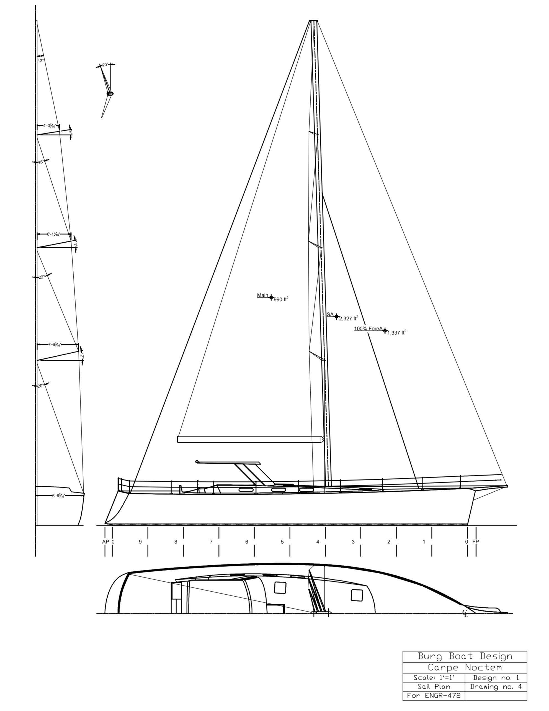

+++
title = "Carpe Noctem"
date = 2026-02-01
[params]
    vessel = "Sail"
    length = '73 ft'
    status = 'Preliminary Design'
    featured = true
+++


    The Carpe Noctem is the first sailboat design in my collection. At 73' LOA and an 18' beam, this blue water cruiser is ready for adventure. Designed to carry a crew of four, this easy to sail marconi rig cutter is capable of crossing oceans, navigating shallow waterways, or voyaging from port to port around a continent.




    The sail plan prioritizes ease of handling while maintaining competitive upwind performance. With a Dellenbaugh Coefficient of 10 degrees, the Carpe Noctem was designed with comfort in mind. [continue on about sailplan and stability here]




    The large semi-enclosed cockpit is perfect for hosting cocktail parties, lunch with the family, and especially sailing through foul weather. The dual helm station helps with visibility while sailing through crowded waterways. Enjoy a nice afternoon on the sundeck, and retreat to the lavish interior for drinks in the lounge.



